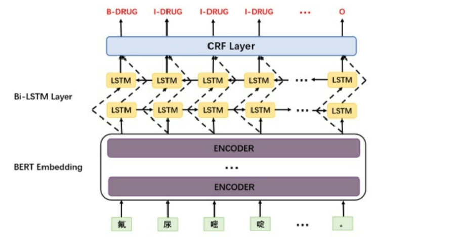
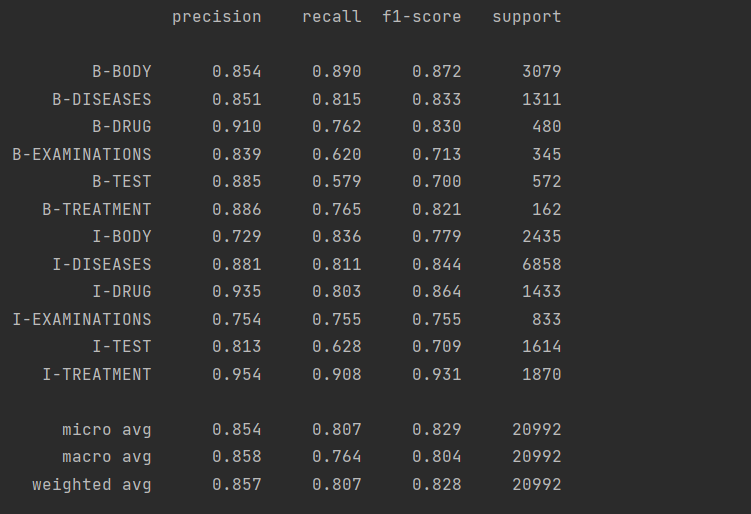

# 中国医疗实体关系基于BERT + Bi-LSTM+ CRF

## 1 - 数据集
```
./CCKS_2019_Task1
    - subtask1_training_part1.txt
    - subtask1_training_part2.txt
    - subtask1_test_set_with_answer.json
```
原始数据格式：
```angular2html
{"originalText": ...,"entities": [{"label_type": "解剖部位", "start_pos": 39, "end_pos": 40},...,{"label_type": "解剖部位", "start_pos": 45, "end_pos": 46}]}
```
经Preprocess.ipynb + BERT+Bi_LSTM+CRF.ipynb，将其转成实体关系所需的格式：
```angular2html
伴	O
两	B-BODY
上	I-BODY
肢	I-BODY
水	O
肿	O
```

## 2 - 模型结构


## 3 - 实验效果

